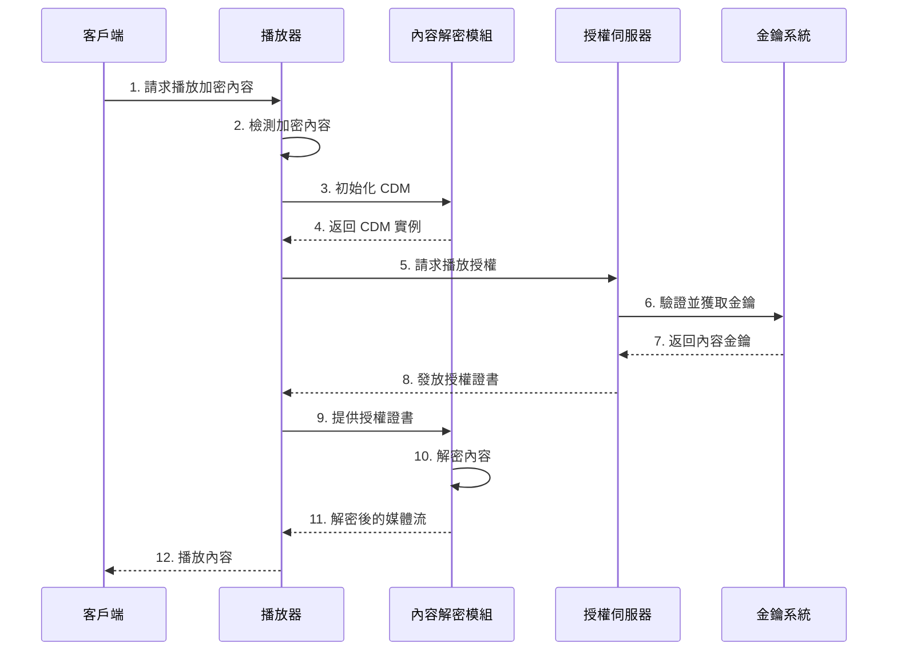

# DRM Video Player Demo

使用 React 和 Shaka Player 實現的 DRM 影片播放器示範。展示了如何在網頁應用程式中實現受保護內容的播放，包括未加密內容和使用 Widevine DRM 保護的內容。

## 加密效果展示

### 未加密截圖


### 加密後截圖


## DRM 技術原理

### DRM (Digital Rights Management)**
  - 數位版權管理系統
  - 用於保護數位內容的技術和系統
  - 控制數位內容的使用、修改和分發



### EME (Encrypted Media Extensions)
  - W3C 標準的網頁 API
  - 使網頁應用能與 DRM 系統互動
  - 提供標準化的加密媒體處理介面

1. **抽象層設計**
   - EME 作為瀏覽器和 DRM 系統之間的抽象層
   - 不直接實現加密，而是提供標準介面
   - 支援多種 DRM 系統（Widevine、PlayReady、FairPlay）

2. **關鍵元件**
   - MediaKeys：管理解密金鑰
   - MediaKeySession：處理授權請求和更新
   - Content Decryption Module (CDM)：實際執行解密的模組

3. **工作流程**
   - 應用程式請求金鑰系統訪問權限
   - 創建 MediaKeys 實例
   - 與授權伺服器交換訊息
   - CDM 處理內容解密

### DRM 系統架構

1. **內容加密**
   - 使用 AES-128 等加密算法
   - 內容金鑰（CEK）加密媒體
   - 金鑰加密金鑰（KEK）保護 CEK

2. **金鑰傳遞**
   - 安全通道建立
   - 金鑰交換協議
   - 臨時會話金鑰生成

3. **授權管理**
   - 用戶認證和授權
   - 播放權限控制
   - 使用限制實施

4. **安全考慮**
   - 硬體安全等級要求
   - 防篡改機制
   - 安全時鐘同步

## 功能特點

- 支援 DASH 格式影片播放
- 支援 Widevine DRM 內容播放
- 響應式設計
- 簡潔的使用者介面
- 自動播放支援
- 錯誤處理和日誌記錄

## Tech Stack

- React + TypeScript
- Vite
- Tailwind CSS
- Shaka Player
- Widevine DRM

## Quick Start

1. Clone 專案：
```bash
git clone [your-repository-url]
cd DrmDemo
```

2. 安裝依賴：
```bash
npm install
```

3. 啟動開發伺服器：
```bash
npm run dev
```


## 建構 DRM 系統步驟

想要建構自己的 DRM 系統，主要步驟：

1. **內容準備**
   - 準備原始媒體內容（視頻、音頻）
   - 使用編碼工具將內容轉換為適合串流的格式（如 DASH）
   - 選擇合適的 DRM 系統（Widevine、PlayReady、FairPlay 等）

2. **加密過程**
   - 生成內容金鑰（Content Key）
   - 使用內容金鑰加密媒體內容
   - 生成金鑰 ID（Key ID）
   - 產生加密後的 DASH 或 HLS 資源

3. **授權伺服器設置**
   - 建立授權伺服器（License Server）
   - 實現授權邏輯和規則
   - 設置金鑰管理系統
   - 配置安全通訊協定（如 HTTPS）

4. **金鑰管理**
   - 建立金鑰管理系統（KMS）
   - 實現金鑰輪換機制
   - 設置金鑰存儲和備份
   - 建立金鑰分發機制

5. **播放器整合**
   - 選擇支援 DRM 的播放器（如 Shaka Player）
   - 配置 DRM 系統參數
   - 實現授權請求邏輯
   - 處理錯誤和異常情況

6. **安全考慮**
   - 實現 HTTPS
   - 設置跨域資源共享（CORS）
   - 實現用戶認證和授權
   - 防止金鑰洩露和未授權訪問

7. **測試和監控**
   - 測試不同設備和瀏覽器的相容性
   - 監控授權請求和播放狀態
   - 實現日誌記錄和分析
   - 設置警報機制

## 注意事項

1. DRM 系統需要瀏覽器支援。確保你的瀏覽器支援 Widevine DRM。
2. 在生產環境中，你需要：
   - 使用自己的 DRM 授權伺服器
   - 實現適當的用戶認證
   - 保護金鑰和授權資訊
   - 監控和記錄系統使用情況
3. 需要注意防範已知的破解方法：
   - mix-blend-mode 破解：某些網站可能會利用 CSS 的 mix-blend-mode 屬性來規避 DRM 保護。建議實施額外的保護措施，如：
     - 監控和禁止特定 CSS 屬性的使用
     - 實現多層保護機制
     - 定期更新安全措施

## 開發建議

1. **開發環境設置**
   - 使用測試用的 DRM 授權伺服器
   - 使用未加密的測試內容進行初始開發
   - 實現錯誤處理和日誌記錄

2. **安全性考慮**
   - 不要在客戶端存儲敏感的 DRM 相關資訊
   - 使用安全的通訊協定
   - 實現適當的錯誤處理
   - 考慮離線播放需求

## 參考資源

- [Shaka Player 官方文檔](https://shaka-player-demo.appspot.com/docs/api/index.html)
- [Widevine DRM 文檔](https://www.widevine.com/)
- [DASH-IF 實施指南](https://dashif.org/)

## License

MIT
