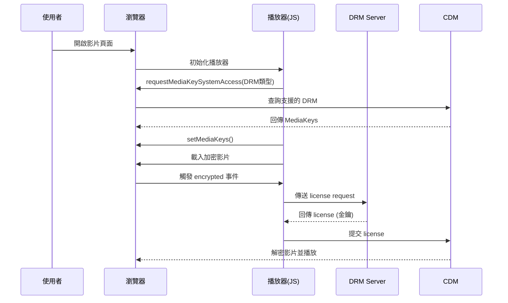
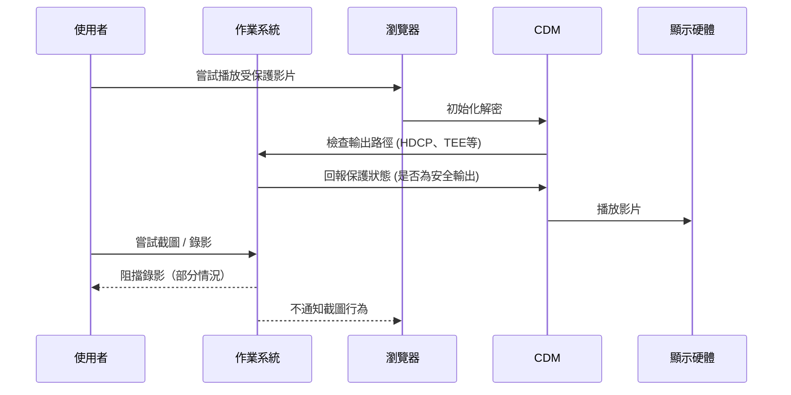

# DRM Video Player Demo

使用 React 和 Shaka Player 實現的 DRM 影片播放器示範。展示了如何在網頁應用程式中實現受保護內容的播放，包括未加密內容和使用 Widevine DRM 保護的內容。

A DRM video player demonstration implemented using React and Shaka Player. It showcases how to play protected content in web applications, including both unencrypted content and content protected by Widevine DRM.

## 實際應用案例 (Real-world Applications)

### Netflix
[Netflix](https://www.netflix.com)

### BuyDRM MultiKey 服務 (BuyDRM MultiKey Service)
[BuyDRM MultiKey Demo](https://buydrm.com/multikey-demo/) 

## 加密效果展示 (Encryption Effect Demonstration)

### 未加密截圖 (Unencrypted Screenshot)


### 加密後截圖 (Encrypted Screenshot)


## DRM (Digital Rights Management)
DRM 指的是數位版權管理 （Digital Rights Management）。DRM 的目的是保護數位化內容的版權，防止數位內容違法流出。DRM 實際上，是以保護含影片、聲音、電子書資料等數位內容版權為目的，其技術的總稱。早在媒體業界，像「版權管理」相對重要的電影發佈中使用。

  - 數位版權管理系統 (Digital Rights Management System)
  - 用於保護數位內容的技術和系統 (Technology and systems for protecting digital content)
  - 控制數位內容的使用、修改和分發 (Controls the use, modification, and distribution of digital content)


### 加密封裝格式 (Encrypted Packaging Format)
  - DASH (.mpd) + CENC + fMP4
  - HLS (.m3u8) + AES-128 or FairPlay 加密

### DRM 系統 (DRM System)
  - 負責發放與管理影片的授權金鑰（License）

| DRM 名稱              | DRM Server 提供者 | 支援的播放器 / 裝置                               | 備註                 |
| ------------------- | -------------- | ----------------------------------------- | ------------------ |
| **Widevine**        | Google         | Chrome、Android、Smart TV、Chromecast、Edge   | 分為 L1 / L2 / L3 等級 |
| **PlayReady**       | Microsoft      | Edge、Windows 系統、Xbox、Smart TV（Samsung、LG） | 多用於 PC、TV、OTT 服務   |
| **FairPlay**        | Apple          | Safari、iOS、tvOS、macOS                     | 專屬於 Apple 生態系      |
| **ClearKey (CENC)** | W3C (開源)       | Chrome、Firefox、Edge                       | 測試或開放用途，無授權加密支援    |

### 支援度寫法
```javascript
if (supportsWidevine) {
  loadPlayer({ drm: 'widevine', licenseUrl: '...' })
} else if (supportsFairPlay) {
  loadPlayer({ drm: 'fairplay', licenseUrl: '...' })
}
```

### 播放器 (Player)

| 播放器（Player）         | 支援的 DRM 類型                  | 備註                            |
| ------------------- | --------------------------- | ----------------------------- |
| **Shaka Player**    | Widevine、PlayReady、ClearKey | Google 提供的開源播放器               |
| **Dash.js**         | Widevine、PlayReady、ClearKey | MPEG-DASH 官方播放器               |
| **Video.js (配合插件)** | Widevine、PlayReady、FairPlay | 需配合 `videojs-contrib-eme` 等外掛 |
| **Bitmovin Player** | Widevine、PlayReady、FairPlay | 商用播放器，支援多 DRM                 |
| **THEOplayer**      | Widevine、PlayReady、FairPlay | 高度相容多平台，但需商業授權                |
| **JW Player (商業)**  | Widevine、PlayReady、FairPlay | 主流 OTT 廠商常用                   |
| **Safari（原生）**      | FairPlay                    | 不支援 Widevine/PlayReady        |
| **Chrome（原生）**      | Widevine                    | 內建 CDM 模組                     |
| **Edge（原生）**        | Widevine、PlayReady          | 根據平台選擇 DRM                    |
| **Firefox（原生）**     | Widevine、ClearKey           | 不支援 PlayReady、FairPlay        |

---

## CDM (Content Decryption Module)
  - 播放器內建的解密模組，與 DRM Server 配對使用。
  - 提供標準化的加密媒體處理介面
  - CDM 是無法被 JavaScript 存取的黑盒子模組

## EME (Encrypted Media Extensions)
  - W3C 標準的網頁 API
  - 使網頁應用能與 DRM/CDM 系統互動
  - 提供標準化的加密媒體處理介面

## 串流播放流程（EME 與 DRM）


---

## 處理截圖與螢幕錄影（由 DRM 裝置層控制）


## Tech Stack

- React + TypeScript
- Vite
- Tailwind CSS
- Shaka Player
- Widevine DRM

## Quick Start

1. Clone 專案 (Clone project)：
```bash
git clone [your-repository-url]
cd DrmDemo
```

2. 安裝依賴 (Install dependencies)：
```bash
npm install
```

3. 啟動開發伺服器 (Start development server)：
```bash
npm run dev
```

## 參考資源 (Reference Resources)

- [Shaka Player 官方文檔 (Official Documentation)](https://shaka-player-demo.appspot.com/docs/api/index.html)
- [Widevine DRM 文檔 (Documentation)](https://www.widevine.com/)
- [DASH-IF 實施指南 (Implementation Guidelines)](https://dashif.org/)
- [W3C Encrypted Media Extensions (EME) 規格文件](https://www.w3.org/TR/encrypted-media/)
- [Google Shaka Player（開源 DRM 播放器）](https://shaka-player-demo.appspot.com/docs/api/tutorial-drm-config.html)
- [Mozilla MDN - Encrypted Media Extensions (EME)](https://developer.mozilla.org/en-US/docs/Web/API/Encrypted_Media_Extensions_API)
- [BuyDRM 官方文件 (BuyDRM Official Documentation)](https://docs.buydrm.com/)
- [Google Widevine DRM](https://www.widevine.com/)
- [Microsoft PlayReady DRM](https://www.microsoft.com/playready/)
- [Apple FairPlay Streaming (FPS)](https://developer.apple.com/streaming/)