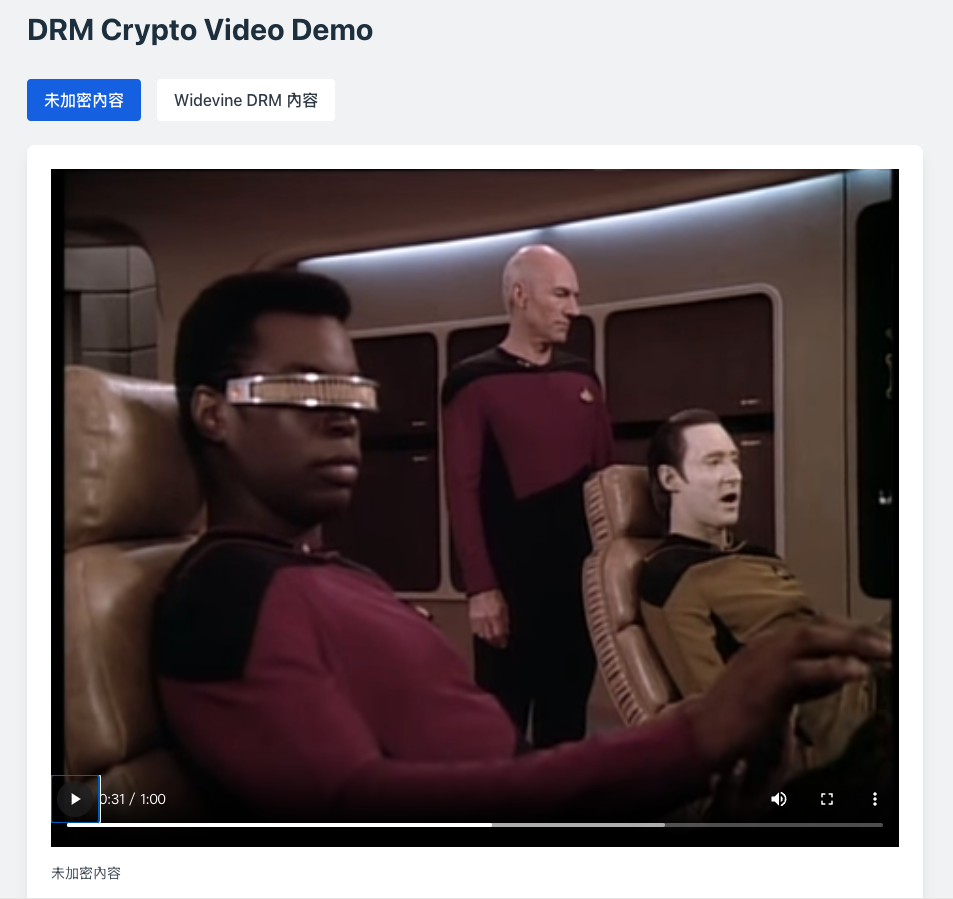
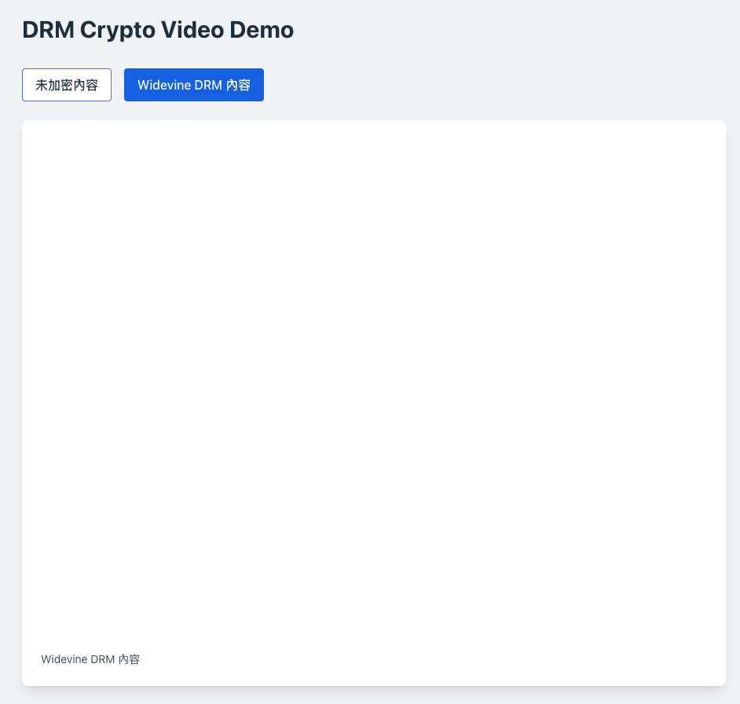
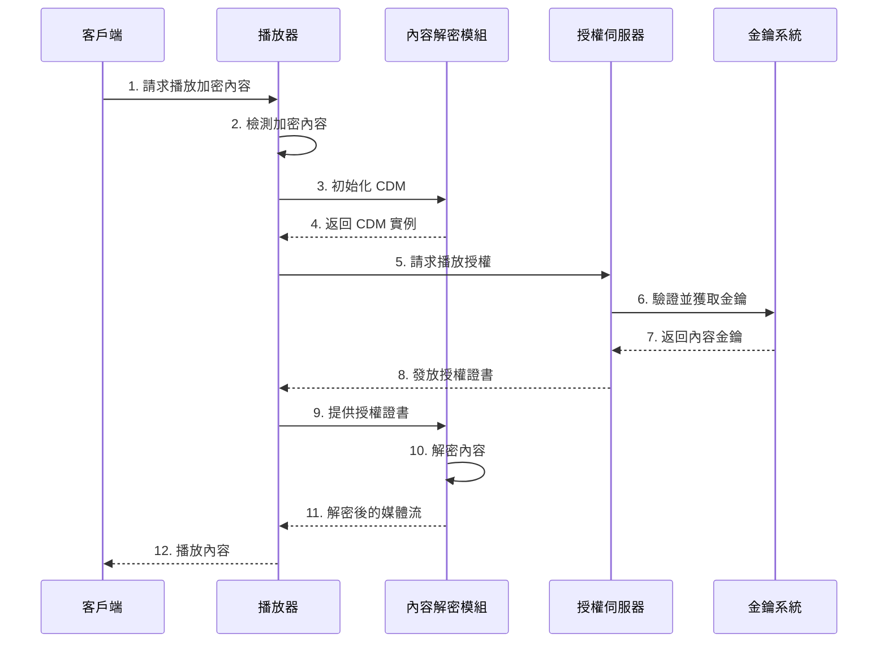

# DRM Video Player Demo

使用 React 和 Shaka Player 實現的 DRM 影片播放器示範。展示了如何在網頁應用程式中實現受保護內容的播放，包括未加密內容和使用 Widevine DRM 保護的內容。

A DRM video player demonstration implemented using React and Shaka Player. It showcases how to play protected content in web applications, including both unencrypted content and content protected by Widevine DRM.

## 實際應用案例 (Real-world Applications)

### Netflix
[Netflix](https://www.netflix.com)

### BuyDRM MultiKey 服務 (BuyDRM MultiKey Service)
[BuyDRM MultiKey Demo](https://buydrm.com/multikey-demo/) 

## 加密效果展示 (Encryption Effect Demonstration)

### 未加密截圖 (Unencrypted Screenshot)


### 加密後截圖 (Encrypted Screenshot)


## DRM 技術原理 (DRM Technical Principles)

### DRM (Digital Rights Management)
  - 數位版權管理系統
  - 用於保護數位內容的技術和系統
  - 控制數位內容的使用、修改和分發

  - Digital Rights Management System
  - Technology and systems for protecting digital content
  - Controls the use, modification, and distribution of digital content



### EME (Encrypted Media Extensions)
  - W3C 標準的網頁 API
  - 使網頁應用能與 DRM 系統互動
  - 提供標準化的加密媒體處理介面

  - W3C standard web API
  - Enables web applications to interact with DRM systems
  - Provides standardized interface for encrypted media handling

1. **抽象層設計 (Abstract Layer Design)**
   - EME 作為瀏覽器和 DRM 系統之間的抽象層
   - 不直接實現加密，而是提供標準介面
   - 支援多種 DRM 系統（Widevine、PlayReady、FairPlay）

   - EME serves as an abstraction layer between browser and DRM systems
   - Does not implement encryption directly, but provides standard interfaces
   - Supports multiple DRM systems (Widevine, PlayReady, FairPlay)

2. **關鍵元件 (Key Components)**
   - MediaKeys：管理解密金鑰
   - MediaKeySession：處理授權請求和更新
   - Content Decryption Module (CDM)：實際執行解密的模組

   - MediaKeys: Manages decryption keys
   - MediaKeySession: Handles license requests and updates
   - Content Decryption Module (CDM): Module that performs actual decryption

3. **工作流程 (Workflow)**
   - 應用程式請求金鑰系統訪問權限
   - 創建 MediaKeys 實例
   - 與授權伺服器交換訊息
   - CDM 處理內容解密

   - Application requests access to key system
   - Creates MediaKeys instance
   - Exchanges messages with license server
   - CDM handles content decryption

### DRM 系統架構 (DRM System Architecture)

1. **內容加密 (Content Encryption)**
   - 使用 AES-128 等加密算法
   - 內容金鑰（CEK）加密媒體
   - 金鑰加密金鑰（KEK）保護 CEK

   - Uses encryption algorithms like AES-128
   - Content Encryption Key (CEK) encrypts media
   - Key Encryption Key (KEK) protects CEK

2. **金鑰傳遞 (Key Delivery)**
   - 安全通道建立
   - 金鑰交換協議
   - 臨時會話金鑰生成

   - Secure channel establishment
   - Key exchange protocols
   - Temporary session key generation

3. **授權管理 (License Management)**
   - 用戶認證和授權
   - 播放權限控制
   - 使用限制實施

   - User authentication and authorization
   - Playback rights control
   - Usage restriction implementation

4. **安全考慮 (Security Considerations)**
   - 硬體安全等級要求
   - 防篡改機制
   - 安全時鐘同步

   - Hardware security level requirements
   - Anti-tampering mechanisms
   - Secure clock synchronization

## 功能特點 (Features)

- 支援 DASH 格式影片播放
- 支援 Widevine DRM 內容播放
- 響應式設計
- 簡潔的使用者介面
- 自動播放支援
- 錯誤處理和日誌記錄

- Supports DASH format video playback
- Supports Widevine DRM content playback
- Responsive design
- Clean user interface
- Auto-play support
- Error handling and logging

## Tech Stack

- React + TypeScript
- Vite
- Tailwind CSS
- Shaka Player
- Widevine DRM

## Quick Start

1. Clone 專案 (Clone project)：
```bash
git clone [your-repository-url]
cd DrmDemo
```

2. 安裝依賴 (Install dependencies)：
```bash
npm install
```

3. 啟動開發伺服器 (Start development server)：
```bash
npm run dev
```

## 建構 DRM 系統步驟 (Steps to Build a DRM System)

想要建構自己的 DRM 系統，主要步驟：

To build your own DRM system, main steps include:

1. **內容準備 (Content Preparation)**
   - 準備原始媒體內容（視頻、音頻）
   - 使用編碼工具將內容轉換為適合串流的格式（如 DASH）
   - 選擇合適的 DRM 系統（Widevine、PlayReady、FairPlay 等）

   - Prepare original media content (video, audio)
   - Convert content to streaming-suitable formats (like DASH) using encoding tools
   - Choose appropriate DRM system (Widevine, PlayReady, FairPlay, etc.)

2. **加密過程 (Encryption Process)**
   - 生成內容金鑰（Content Key）
   - 使用內容金鑰加密媒體內容
   - 生成金鑰 ID（Key ID）
   - 產生加密後的 DASH 或 HLS 資源

   - Generate content key
   - Encrypt media content using content key
   - Generate key ID
   - Produce encrypted DASH or HLS assets

3. **授權伺服器設置 (License Server Setup)**
   - 建立授權伺服器（License Server）
   - 實現授權邏輯和規則
   - 設置金鑰管理系統
   - 配置安全通訊協定（如 HTTPS）

   - Establish license server
   - Implement licensing logic and rules
   - Set up key management system
   - Configure secure communication protocols (like HTTPS)

4. **金鑰管理 (Key Management)**
   - 建立金鑰管理系統（KMS）
   - 實現金鑰輪換機制
   - 設置金鑰存儲和備份
   - 建立金鑰分發機制

   - Establish Key Management System (KMS)
   - Implement key rotation mechanism
   - Set up key storage and backup
   - Establish key distribution mechanism

5. **播放器整合 (Player Integration)**
   - 選擇支援 DRM 的播放器（如 Shaka Player）
   - 配置 DRM 系統參數
   - 實現授權請求邏輯
   - 處理錯誤和異常情況

   - Choose DRM-supported player (like Shaka Player)
   - Configure DRM system parameters
   - Implement license request logic
   - Handle errors and exceptions

6. **安全考慮 (Security Considerations)**
   - 實現 HTTPS
   - 設置跨域資源共享（CORS）
   - 實現用戶認證和授權
   - 防止金鑰洩露和未授權訪問

   - Implement HTTPS
   - Set up Cross-Origin Resource Sharing (CORS)
   - Implement user authentication and authorization
   - Prevent key leakage and unauthorized access

7. **測試和監控 (Testing and Monitoring)**
   - 測試不同設備和瀏覽器的相容性
   - 監控授權請求和播放狀態
   - 實現日誌記錄和分析
   - 設置警報機制

   - Test compatibility across different devices and browsers
   - Monitor license requests and playback status
   - Implement logging and analytics
   - Set up alert mechanisms

## 注意事項 (Important Notes)

1. DRM 系統需要瀏覽器支援。確保你的瀏覽器支援 Widevine DRM。

   DRM system requires browser support. Ensure your browser supports Widevine DRM.

2. 在生產環境中，你需要：
   - 使用自己的 DRM 授權伺服器
   - 實現適當的用戶認證
   - 保護金鑰和授權資訊
   - 監控和記錄系統使用情況

   In production environment, you need to:
   - Use your own DRM license server
   - Implement proper user authentication
   - Protect keys and license information
   - Monitor and log system usage

3. 需要注意防範已知的破解方法：
   - mix-blend-mode 破解：某些網站可能會利用 CSS 的 mix-blend-mode 屬性來規避 DRM 保護。建議實施額外的保護措施，如：
     - 監控和禁止特定 CSS 屬性的使用
     - 實現多層保護機制
     - 定期更新安全措施

   Be aware of known circumvention methods:
   - mix-blend-mode bypass: Some websites might use CSS mix-blend-mode property to circumvent DRM protection. Recommended additional protection measures include:
     - Monitor and prevent usage of specific CSS properties
     - Implement multi-layer protection mechanisms
     - Regular security measure updates

## 開發建議 (Development Recommendations)

1. **開發環境設置 (Development Environment Setup)**
   - 使用測試用的 DRM 授權伺服器
   - 使用未加密的測試內容進行初始開發
   - 實現錯誤處理和日誌記錄

   - Use test DRM license server
   - Use unencrypted test content for initial development
   - Implement error handling and logging

2. **安全性考慮 (Security Considerations)**
   - 不要在客戶端存儲敏感的 DRM 相關資訊
   - 使用安全的通訊協定
   - 實現適當的錯誤處理
   - 考慮離線播放需求

   - Don't store sensitive DRM-related information on client side
   - Use secure communication protocols
   - Implement proper error handling
   - Consider offline playback requirements

## 參考資源 (Reference Resources)

- [Shaka Player 官方文檔 (Official Documentation)](https://shaka-player-demo.appspot.com/docs/api/index.html)
- [Widevine DRM 文檔 (Documentation)](https://www.widevine.com/)
- [DASH-IF 實施指南 (Implementation Guidelines)](https://dashif.org/)
